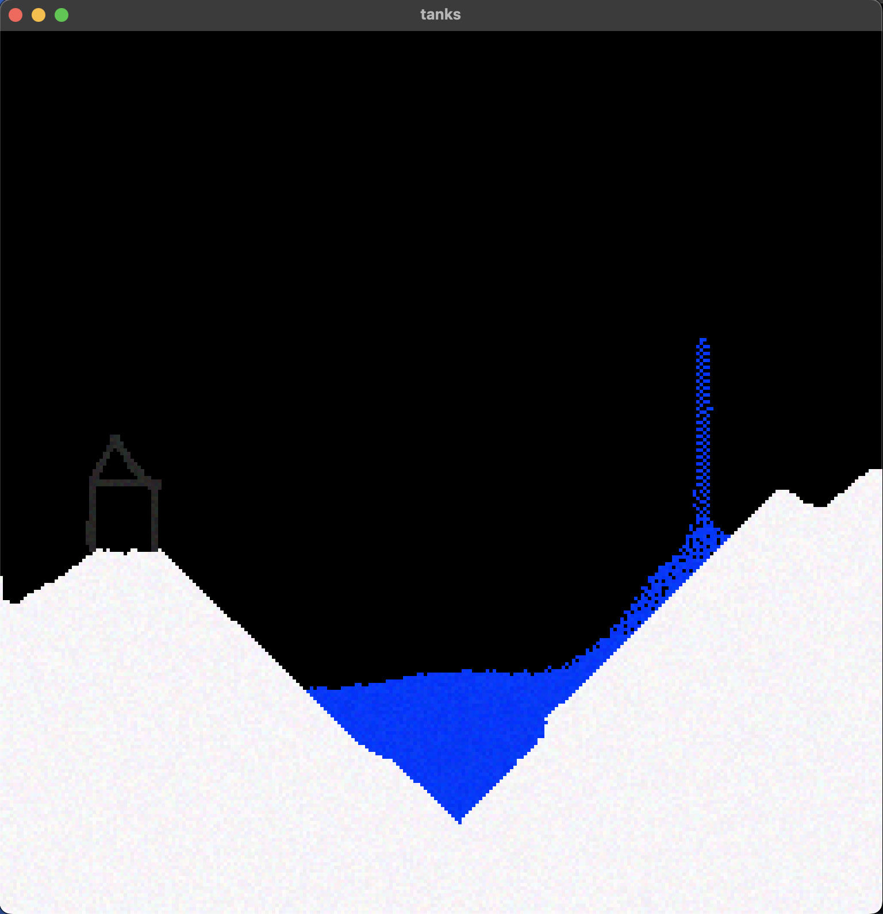

# gunpowder
### Temporary Controls:
### H, J, K, L: Select Solid, Sand, Water, or Gas
### 1 - 9: Select Brush Size
### Hold V + Click: Create Explosion


Remember those powder game or dust sim type of games? The king being https://dan-ball.jp/en/javagame/dust/    
Remember those side to side tank games from back in the day where you could take turns trying to land shots on each other?    
The idea of this project is to combine these types of old school online games into one. For now though, this project is in a very early stage that is just focused on developing the powder sim. Use the temporary controls listed above to mess with some falling sand! 

## Building
Currently MacOS only (M1 included). Linux should work with minor Makefile tweaks. You will need CMake installed to build GLFW.
```bash
git clone --recurse-submodules https://github.com/collebrusco/gunpowder
cd gunpowder
make all
# to run:
make r
```

